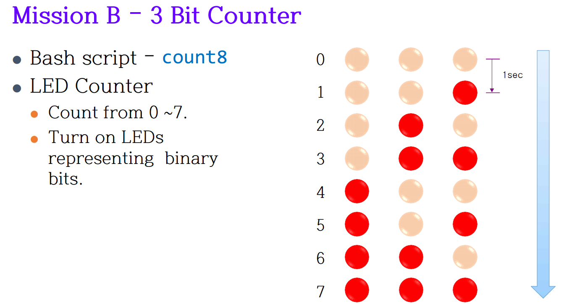
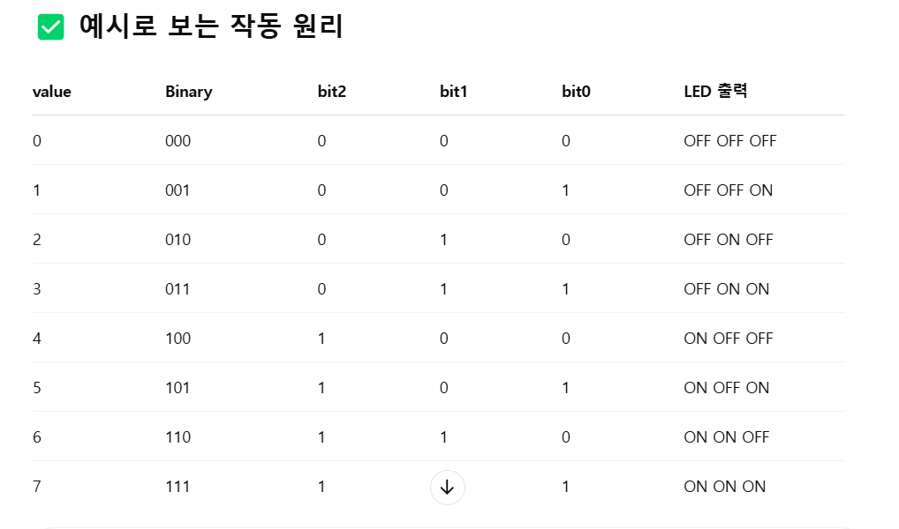

# Mission B - 3 Bit LED Counter  
세 개의 LED를 이진수 형태로 제어해서, 0부터 7까지의 값을 1sec 간격으로 반복적으로 표현하는 것입니다.

즉, 000부터 111까지, 3비트 이진수 카운터를 LED로 구현하는 과제입니다.



---

## 📘 개요

3 Bit LED Counter를 구현하는 과제입니다.  
Bash 스크립트(`3_Bit_Counter.sh`)를 작성하여 3개의 LED를 통해 0부터 7까지 숫자를 이진수로 표현합니다.

---

## 🧠 프로젝트 설명

이 프로젝트는 **Raspberry Pi의 GPIO 핀**과 **bash 스크립트**를 이용하여  
숫자 0부터 7까지의 값을 3개의 LED로 이진수 형태로 출력하는 카운터 시스템입니다.

스크립트를 실행하면 3개의 LED가 현재 숫자를 이진수로 나타내며,  
1초마다 숫자가 1씩 증가하면서 LED 상태가 바뀝니다.

---

## ✨ 주요 기능

- 🔢 0 ~ 7 숫자 카운팅
- ⏱️ 1초 간격 자동 점등
- 💡 이진수 LED 출력 (3개 LED로 표현)
- 🧰 Raspberry Pi GPIO 핀 제어

---

## 🔧 기술 구성

- **Raspberry Pi** – GPIO 핀 제어
- **bash script** – 제어용 스크립트 언어

---

## 🔌 회로 구성 설명

- 각 LED는 **330Ω 저항**을 거쳐 브레드보드의 **GND에 연결**
- Raspberry Pi의 GPIO 핀이 **HIGH(dh)** 상태가 되면 전류가 흐르며 LED가 점등됨
- pinctrl 명령어를 사용해 핀을 제어

---

## 📌 핀 구성 및 역할

| 핀 번호    | 역할             | 설명                            |
|------------|------------------|---------------------------------|
| GPIO 17    | LSB (1의 자리)   | 가장 작은 비트를 제어하는 LED |
| GPIO 22    | Middle (2의 자리)| 중간 비트를 제어하는 LED       |
| GPIO 27    | MSB (4의 자리)   | 가장 큰 비트를 제어하는 LED   |

---

## 💻 스크립트 코드

```
#!/usr/bin/env bash
# 스크립트 실행 시 시스템의 환경 변수(PATH)에서 bash 인터프리터를 자동으로 찾아 실행합니다.
# 시스템에 따라 bash 경로가 다를 수 있어, 이 방법은 호환성이 높은 portable 방식입니다.

# ============================================
# 1. GPIO 핀 번호 설정
# ============================================
# 사용할 GPIO 핀 번호를 각각의 변수로 저장합니다.
# 각 핀은 이진수의 각 비트 역할을 합니다.
# 예: value = 5 → 101 → GPIO 22, 27, 17 순으로 LED ON/OFF 결정
gpio_bit0=17  # LSB (1의 자리)
gpio_bit1=27  # Middle bit (2의 자리)
gpio_bit2=22  # MSB (4의 자리)

# ============================================
# 2. GPIO 핀 출력 모드 설정 함수
# ============================================
# LED를 켜고 끄기 위해 GPIO 핀을 출력 모드로 설정합니다.
initialize_pins() {
    for pin in $gpio_bit0 $gpio_bit1 $gpio_bit2; do
        pinctrl set "$pin" op || {
            echo "[ERROR] GPIO $pin 출력 모드 설정 실패"
            exit 1
        }
    done
}

# ============================================
# 3. 종료 시 모든 LED를 끄는 함수
# ============================================
# Ctrl+C (SIGINT) 또는 종료 시그널(SIGTERM)을 감지했을 때 호출됩니다.
# 모든 LED를 OFF(dl) 상태로 만든 후 스크립트를 종료합니다.
stop_to_ctrlC() {
    echo "LED 끄는 중..."
    pinctrl set $gpio_bit0 dl
    pinctrl set $gpio_bit1 dl
    pinctrl set $gpio_bit2 dl
    exit 0
}

# ============================================
# 4. 종료 시그널 감지 설정
# ============================================
# 사용자가 Ctrl+C를 누르거나 시스템에서 SIGINT, SIGTERM 시그널을 보낼 경우,
# 위에서 정의한 stop_to_ctrlC 함수를 호출하여 LED를 끄고 안전하게 종료합니다.
trap stop_to_ctrlC SIGINT SIGTERM

# ============================================
# 5. 초기화: GPIO 핀을 출력 모드로 설정
# ============================================
initialize_pins

# ============================================
# 6. 메인 루프: 0부터 7까지 반복하며 3비트 이진수 출력
# ============================================
while true; do
    for value in {0..7}; do
        # ====================================
        # 6-1. 비트 분해
        # value(0~7)를 이진수로 분해해서 각 자리 비트를 구합니다.
        # 비트 연산: 시프트(>>) 후 AND(& 1)로 특정 자릿수만 추출
        # 예: value=6 → 110 → bit2=1, bit1=1, bit0=0
        # ====================================
        bit0=$(( (value >> 0) & 1 ))  # LSB (1의 자리)
        bit1=$(( (value >> 1) & 1 ))  # Middle (2의 자리)
        bit2=$(( (value >> 2) & 1 ))  # MSB (4의 자리)

        # ====================================
        # 6-2. LED 제어
        # 각 비트의 값이 1이면 해당 핀을 HIGH(dh), 아니면 LOW(dl)로 설정
        # ====================================
        pinctrl set $gpio_bit0 $( [ $bit0 -eq 1 ] && echo dh || echo dl )
        pinctrl set $gpio_bit1 $( [ $bit1 -eq 1 ] && echo dh || echo dl )
        pinctrl set $gpio_bit2 $( [ $bit2 -eq 1 ] && echo dh || echo dl )

        # 6-3. 1초 대기 후 다음 숫자로
        sleep 1
    done
done
```




| 값 (10진수) | 이진수 | GPIO 17 (bit2) | GPIO 27 (bit1) | GPIO 22 (bit0) |
|-------------|--------|----------------|----------------|----------------|
| 0           | `000`  | ⚫ OFF          | ⚫ OFF          | ⚫ OFF          |
| 1           | `001`  | ⚫ OFF          | ⚫ OFF          | 🔴 ON           |
| 2           | `010`  | ⚫ OFF          | 🔴 ON           | ⚫ OFF          |
| 3           | `011`  | ⚫ OFF          | 🔴 ON           | 🔴 ON           |
| 4           | `100`  | 🔴 ON           | ⚫ OFF          | ⚫ OFF          |
| 5           | `101`  | 🔴 ON           | ⚫ OFF          | 🔴 ON           |
| 6           | `110`  | 🔴 ON           | 🔴 ON           | ⚫ OFF          |
| 7           | `111`  | 🔴 ON           | 🔴 ON           | 🔴 ON           |


