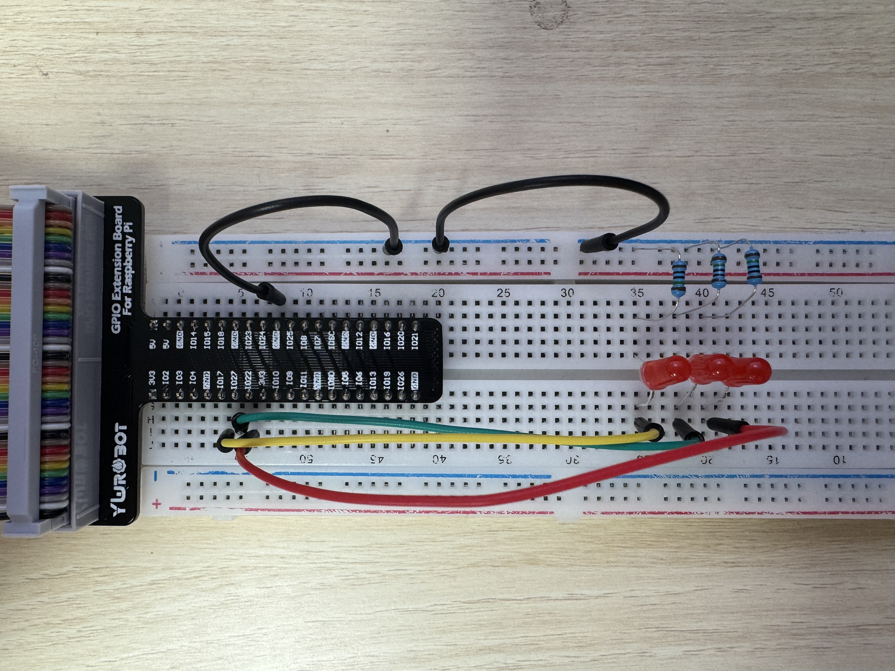

## 💡 Mission A - LED 도미노 과제

#### Youtube Link
https://www.youtube.com/watch?v=iAdeRDD6hqY

본 스크립트는 Raspberry Pi의 GPIO 핀을 제어하여 LED를 도미노처럼 순차적으로 점등하는 과제입니다.  
사용된 언어는 Bash이며, pinctrl 명령어를 사용해 GPIO 핀의 출력 상태를 조절합니다.


---

### 📋 주요 기능 요약

- ✅ LED는 1초 간격으로 하나씩 순차적으로 켜집니다.
- ✅ 한 번에 **오직 하나의 LED만 ON**, 나머지는 OFF 상태입니다.
- ✅ Ctrl + C로 스크립트를 종료하면 LED가 모두 꺼지고 안전하게 종료됩니다.
- ✅ `GPIO 17`, `27`, `22`, `5`번 핀을 사용하여 총 4개의 LED를 제어합니다.

---

### 회로 구성(PinMap)



해당 회로는 Raspberry Pi의 GPIO 핀을 통해 총 4개의 빨간색 LED를 제어하도록 설계되었습니다.  
브레드보드와 GPIO 익스텐션 보드를 활용하여 다음과 같은 방식으로 연결되었습니다:

#### ✅ 연결 요약

| 구성 요소           | 설명 |
|--------------------|------|
| **GPIO 17** | 첫 번째 LED 제어 (노란색 점퍼선) |
| **GPIO 27** | 두 번째 LED 제어 (초록색 점퍼선) |
| **GPIO 22** | 세 번째 LED 제어 (검정색 점퍼선) |
| **GPIO 5** | 네 번째 LED 제어 (빨간색 점퍼선) |
| **330Ω 저항**       | 각 LED의 직렬 연결에 사용, 전류 제한 목적 |
| **GND (핀 6)**       | 모든 저항의 반대쪽을 공통 GND로 연결 (검정 점퍼선) |

#### 🔌 전기적 흐름

1. 각 GPIO 핀은 출력 모드로 설정되며, **dh(High)** 상태가 되면 해당 핀에 전압이 공급됩니다.
2. 전류는 GPIO → LED → 저항 → GND 방향으로 흐르며 LED가 점등됩니다.
3. **dl(Low)** 상태일 경우 전압이 없으므로 LED는 꺼집니다.
4. 저항은 LED 보호를 위해 **330Ω** 값이 사용되었습니다.

#### 🧰 사용 부품

- 빨간색 LED × 4
- 330Ω 저항 × 4

#### 📌 참고 사항

- 각 LED는 독립적인 GPIO 핀에 연결되어 있어, 도미노처럼 순차적으로 점등 가능합니다.
- GND는 하나의 공통 라인으로 묶여 있으며, 모든 저항의 반대쪽을 해당 GND에 연결합니다.

### 🔧 사용된 GPIO 핀 설정

| 핀 번호  | 설명                 |
|----------|----------------------|
| GPIO 17  | LED 1                |
| GPIO 27  | LED 2                |
| GPIO 22  | LED 3                |
| GPIO 5   | LED 4                |

---

### 🧾 코드 전체 설명

```
#!/usr/bin/bash
# ----------------------------
# LED 도미노 점등 스크립트
# - Raspberry Pi GPIO 사용
# - 각 핀의 LED를 도미노처럼 순차적으로 점등
# - Ctrl+C 입력 시 LED OFF 후 안전 종료
# ----------------------------

# ✅ 1. GPIO 핀 번호 설정
# 사용할 GPIO 핀들을 각각 변수로 선언합니다.
# 아래는 총 4개의 LED에 해당하는 핀 번호입니다.
gpio0=17  # 첫 번째 LED에 연결된 GPIO
gpio1=27  # 두 번째 LED에 연결된 GPIO
gpio2=22  # 세 번째 LED에 연결된 GPIO
gpio3=5   # 네 번째 LED에 연결된 GPIO

# ✅ 2. 배열로 핀 묶기
# 위에서 선언한 핀들을 배열로 묶어 반복문 처리에 사용합니다.
gpios=($gpio0 $gpio1 $gpio2 $gpio3)

# ✅ 3. 핀을 출력 모드로 설정하는 함수
# 모든 핀을 출력 모드(op)로 전환합니다.
initialize_pins() {
    for pin in "${gpios[@]}"; do
        pinctrl set "$pin" op || {
            echo "[ERROR] GPIO $pin 출력 모드 설정 실패"
            exit 1
        }
    done
}

# ✅ 4. 종료 시 호출되는 함수
# Ctrl+C 등의 종료 시그널이 발생하면 모든 핀을 LOW(dl)로 설정하고 종료합니다.
turn_off_all() {
    for pin in "${gpios[@]}"; do
        pinctrl set "$pin" dl  # LED OFF
    done
    echo "LED OFF 후 종료합니다."
    exit 0
}

# ✅ 5. 루프 내에서 반복적으로 호출되는 LED OFF 함수
# 각 반복마다 이전 LED를 끄기 위해 모든 핀을 LOW(dl) 상태로 만듭니다.
turn_off_leds() {
    for pin in "${gpios[@]}"; do
        pinctrl set "$pin" dl  # 모든 LED 끄기
    done
}

# ✅ 6. 종료 신호(Ctrl+C 등) 감지
# SIGINT(Ctrl+C), SIGTERM 등이 발생하면 turn_off_all 함수가 호출되어 LED를 끄고 종료합니다.
trap turn_off_all SIGINT SIGTERM

# ✅ 7. 실행 전 핀 초기화
initialize_pins

# ✅ 8. 도미노 LED 점등 무한 루프
# 배열의 각 핀에 대해 순차적으로 하나만 LED를 켜고, 1초 대기 후 다음 LED를 점등합니다.
# 이 과정을 무한 반복합니다.
while true; do
    for i in "${!gpios[@]}"; do
        turn_off_leds                     # 현재 모든 LED 끄기
        pinctrl set "${gpios[$i]}" dh     # 해당 핀만 HIGH → LED ON
        sleep 1                           # 1초 대기 후 다음 LED
    done
done

```

---

### 🛠 실행 방법

1. 터미널에서 스크립트에 실행 권한을 부여합니다:

```bash
chmod +x LED_Domino.sh
```

2. 스크립트를 실행합니다:

```bash
./LED_Domino.sh
```

3. Ctrl + C로 종료하면 모든 LED가 꺼집니다.

---

### 📌 실행 결과 예시 (도미노 순차 점등)

```
🟥 ⬛ ⬛ ⬛   ← LED1 ON
⬛ 🟥 ⬛ ⬛   ← LED2 ON
⬛ ⬛ 🟥 ⬛   ← LED3 ON
⬛ ⬛ ⬛ 🟥   ← LED4 ON
(다시 반복)
```

