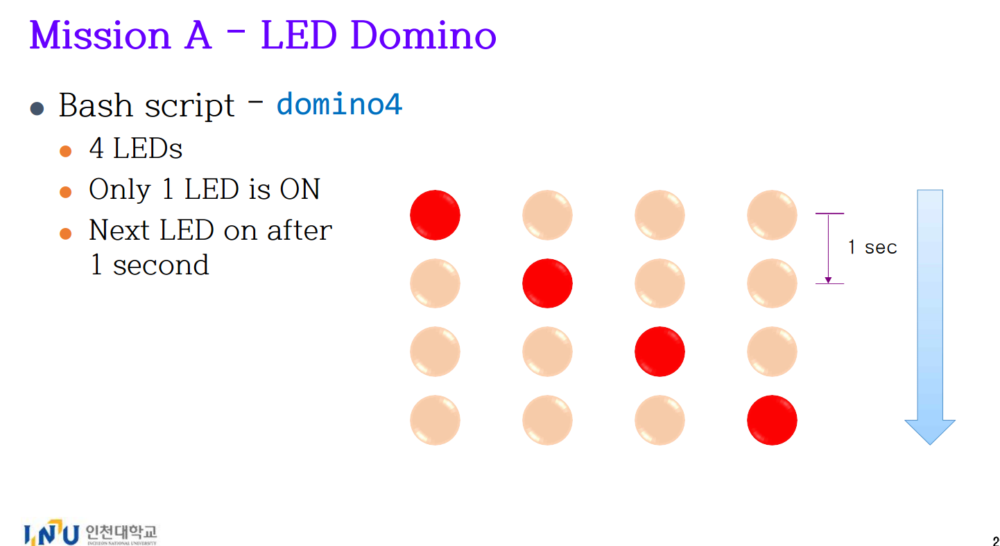
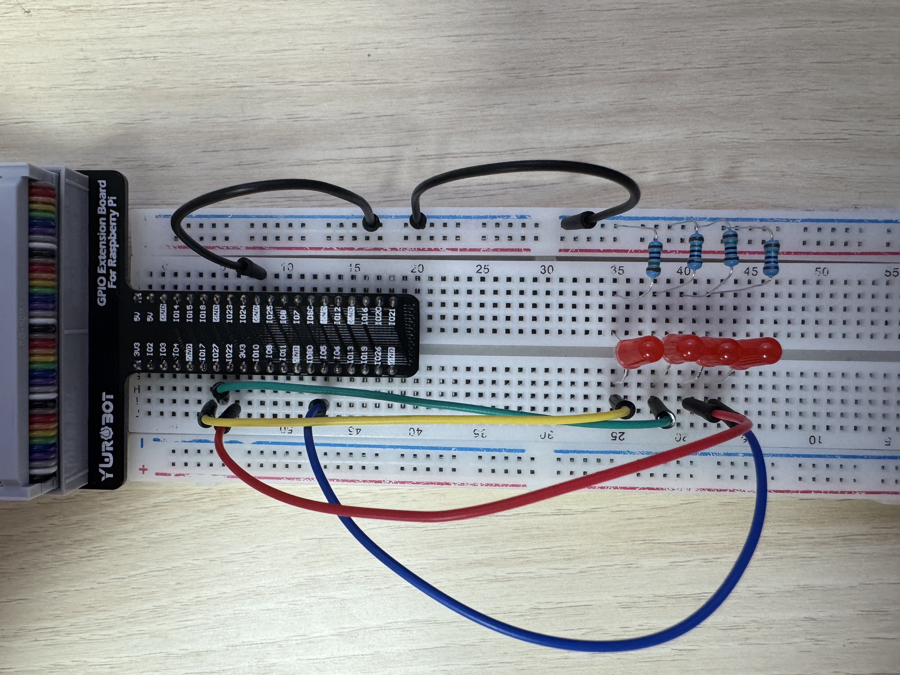

## Youtube Link
https://www.youtube.com/watch?v=Ja7g5K0CZrE

## 📘 개요



이 프로젝트는 **도미노 방식으로 LED를 순서대로 점등**하는 Raspberry Pi GPIO 제어 과제입니다.  
Python을 이용해 4개의 LED를 GPIO 핀에 연결하고, **1초 간격으로 LED를 하나씩 순차적으로 켜는 방식**을 구현합니다.

---

## 💡 프로젝트 설명

이 프로젝트는 **Raspberry Pi의 GPIO 핀**과 **gpiozero 라이브러리**를 사용하여  
**4개의 LED를 도미노처럼 순서대로 점등**하고 다시 반복하는 시스템입니다.  
스크립트를 실행하면 매번 하나의 LED만 켜지며, 나머지 LED는 꺼집니다.  
**1초 간격으로 다음 LED로 이동**하면서 LED가 순차적으로 도는 모습을 구현합니다.

---

## ✨ 주요 기능

- 🔁 **LED 도미노 순차 점등**
- 🧠 **1초 간격 자동 전환**
- 🔌 **GPIO 제어를 위한 gpiozero 사용**
- 💥 **Ctrl+C 종료 시 모든 LED OFF 처리**

---

## 🛠️ 기술 구성

- **Raspberry Pi GPIO 핀 제어**
- **Python + gpiozero 라이브러리**
- **time.sleep을 이용한 주기 제어**
- **signal 모듈을 통한 안전한 종료 처리**

---

## 📍 핀 구성 및 역할

| 핀 번호  | 역할            | 설명                          |
|----------|-----------------|-------------------------------|
| GPIO 17  | 첫 번째 LED      | 도미노의 시작 LED              |
| GPIO 27  | 두 번째 LED     | 중간 LED                       |
| GPIO 22  | 세 번째 LED     | 중간 LED                       |
| GPIO 5   | 네 번째 LED     | 도미노의 마지막 LED           |



---

## ✅ 예시 작동 원리

| 시점         | 점등된 LED 위치 | 설명                         |
|--------------|------------------|------------------------------|
| 첫 1초        | GPIO 17 (1번째)  | 첫 번째 LED ON               |
| 다음 1초      | GPIO 27 (2번째)  | 두 번째 LED ON              |
| 다음 1초      | GPIO 22 (3번째)  | 세 번째 LED ON              |
| 다음 1초      | GPIO 5 (4번째)   | 네 번째 LED ON              |
| 다시 루프     | GPIO 17 (1번째)  | 순환 반복                    |

 라이브러리
# ✅ LED 클래스는 특정 GPIO 핀을 LED처럼 제어할 수 있게 해줌
#    ex) led.on(), led.off(), led.value = 1 (켜짐), 0 (꺼짐) 등

from time import sleep
# ✅ sleep(): 코드 실행을 잠시 멈추는 함수 (단위: 초)
# ✅ 여기선 LED 간의 점등 간격을 1초로 두기 위해 사용

import signal
# ✅ signal: 시스템 종료 시그널을 처리하기 위한 모듈
# ✅ 예: SIGINT (Ctrl+C), SIGTERM (kill 명령 등)
# ✅ 시그널을 감지해서 특정 함수를 실행시킬 수 있음 (여기선 cleanup)

import sys
# ✅ sys: 시스템 관련 기능을 제공하는 모듈
# ✅ 여기선 `sys.exit(0)`을 통해 프로그램을 명시적으로 종료하기 위해 사용


# 사용할 GPIO 핀 번호를 순서대로 리스트에 저장
pins = [17, 27, 22, 5]
# ✅ Raspberry Pi의 GPIO 핀 번호 (BCM 번호 기준)
# ✅ 4개의 핀을 사용하여 4개의 LED 제어

leds = [LED(pin) for pin in pins]
# ✅ 각 핀 번호에 대해 LED 객체를 생성하고 리스트로 저장
# ✅ 이렇게 하면 `leds[0]`은 GPIO 17에 연결된 LED 객체가 됨
# ✅ 반복문을 사용할 수 있어 코드가 간결하고 확장성 있음


# 종료 시 모든 LED OFF 후 프로그램 종료하는 함수 정의
def cleanup(sig, frame):
    print("\nLED OFF 후 종료합니다.")  # 종료 메시지 출력
    for led in leds:      # 모든 LED를 반복하며
        led.off()         # 각각의 LED를 끔
    sys.exit(0)           # 정상 종료 (exit code 0)

# 종료 시그널 핸들링 등록
signal.signal(signal.SIGINT, cleanup)
# ✅ SIGINT: Ctrl+C를 눌렀을 때 발생하는 인터럽트 시그널
# ✅ 이 시그널이 오면 위에서 정의한 cleanup() 함수가 실행됨

signal.signal(signal.SIGTERM, cleanup)
# ✅ SIGTERM: kill 명령 등으로 프로세스 종료 요청 시 발생하는 시그널
# ✅ 이 시그널도 cleanup() 함수로 처리되게 설정


# 무한 루프: LED를 도미노처럼 하나씩 켰다가 끄기
while True:
    for led in leds:           # LED 리스트를 순서대로 반복하면서
        for l in leds:
            l.off()            # 모든 LED를 먼저 꺼줌
        led.on()               # 현재 선택된 LED만 켬
        sleep(1)               # 1초 대기 후 다음 LED로 넘어감

```
